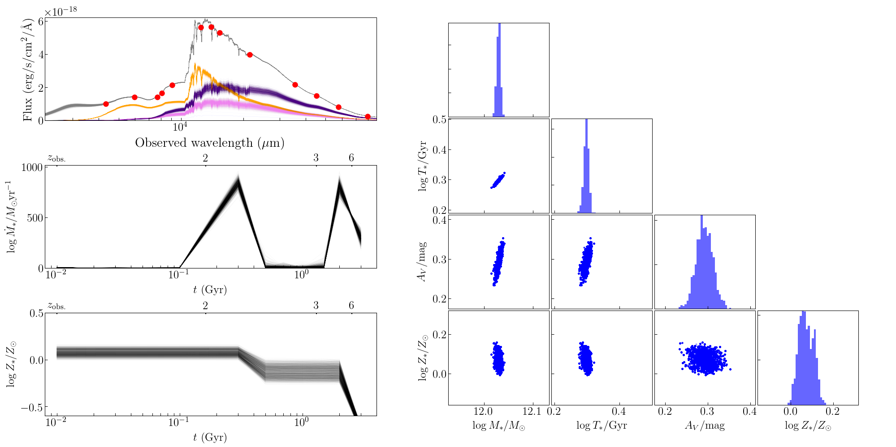

.. |ss| raw:: html

   <strike>

.. |se| raw:: html

   </strike>

GSF (|ss| Grism |se| Great SED Fitter)
~~~~~~~~~~~~~~~~~~~~~~
version 1.7 and after

- SED fitting code used in `Morishita et al. (2018a) <http://adsabs.harvard.edu/abs/2018ApJ...856L...4M>`__ and `Morishita et al. (2019) <https://ui.adsabs.harvard.edu/abs/2019ApJ...877..141M/abstract>`__.
- The main purpose is to explore galaxy star formation histories with a flexible form.
- The code uses FSPS templates generated via python-fsps.
- The code was originally designed for HST grism data, but now it can process a geranal (e.g.,broad band photometry) dataset too. 

========================================================================================

Demonstration
~~~~~~~~~~~~~

- Fitting movie can be found `here <https://youtu.be/pdkA9Judd-M>`__.

Pre-requirement
~~~~~~~~~~~~~~~

- astropy
- Pandas
- multiprocess
- lmfit (no older than ver1.0.0)
- emcee (no older than ver3.0.0)
- corner
- python-fsps (ver0.3.0)
- fsps

Installation & Documentation
~~~~~~~~~~~~~~~~~~~~~~~~~~~~

Required packages will be installed by;

.. code-block:: bash

    pip install -r requirements.txt 

If a user prefers to install in a new conda environment, execute the following before the command above;

.. code-block:: bash

    conda create -n gsf python=3.10
    conda activate gsf

Then, make sure to install `fsps <https://github.com/cconroy20/fsps>`__ and `python-fsps <https://github.com/dfm/python-fsps>`__ by following their instruction.

Lastly, check your installation by;

.. code-block:: bash

    python -m pytest

Done!! :tada:

Examples
~~~~~~~~
An example data set is stored at at `gsf_examples <https://github.com/mtakahiro/gsf_examples/tree/master/example/>`__

.. code-block:: bash

    python run_gsf.py test.input <flag>

If one needs a new config file

.. code-block:: bash

    python example/get_configfile.py

Take a look at `notebooks <https://github.com/mtakahiro/gsf_examples/tree/master/example/>`__ for other use cases.

Execution flag
~~~~~~~~~~~~~~
- 0: Generating z=0 templates (takes a while if MILES). Start from here if any critical parameter (e.g., Z-range, age bins) in config file is changed. This will then automatically proceed to the next step.
- 1: Redshift template to z=z_input, by using existing z=0 templates (from step0). This will then automatically proceed to the next step.
- 2: Fitting part, by using existing redshifted templates (from step1). This will then automatically proceed to the next step.
- 3: Creates SFH and SED plots by using the fitting results.

Release notes
~~~~~~~~~~~~~
- v1.7.5, pytest has been implemented.
- From v1.6, emission lines can be added to the stellar templates. This is controlled by two parameter, Aneb (amplitude) and logU.
- Far IR data set can be fitted simultaneously with a simple gray body spectrum (to be published in a future version).
- From v1.3, log-space samplings for amplitude parameters are implemented.
- From v1.2, BPASS templates can also be implemented. Those who wish to try the functionality, please contact the author.
- From v1.2, data set without grism data, despite the code's name, can be also provided.

Citation
~~~~~~~~

    @ARTICLE{2019ApJ...877..141M,
    author = {{Morishita}, T. and {Abramson}, L.~E. and {Treu}, T. and {Brammer}, G.~B. and {Jones}, T. and {Kelly}, P. and {Stiavelli}, M. and {Trenti}, M. and {Vulcani}, B. and {Wang}, X.},
    title = "{Massive Dead Galaxies at z {\ensuremath{\sim}} 2 with HST Grism Spectroscopy. I. Star Formation Histories and Metallicity Enrichment}",
    journal = {\apj},
    keywords = {galaxies: abundances, galaxies: evolution, galaxies: formation, galaxies: high-redshift, galaxies: star formation, Astrophysics - Astrophysics of Galaxies},
    year = 2019,
    month = jun,
    volume = {877},
    number = {2},
    eid = {141},
    pages = {141},
    doi = {10.3847/1538-4357/ab1d53},
    archivePrefix = {arXiv},
    eprint = {1812.06980},
    primaryClass = {astro-ph.GA},
    adsurl = {https://ui.adsabs.harvard.edu/abs/2019ApJ...877..141M},
    adsnote = {Provided by the SAO/NASA Astrophysics Data System}
    }

