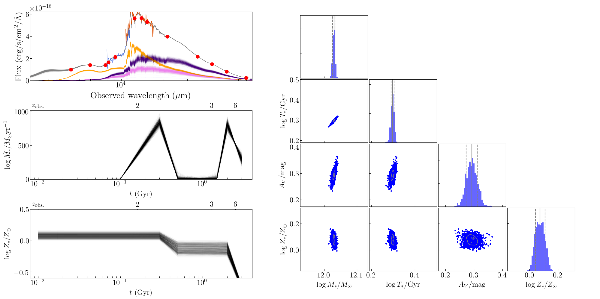

Grism SED Fitter (GSF)
~~~~~~~~~~~~~~~~~~~~~~
version 1.6

- SED fitting code used in `Morishita et al. (2018a) <http://adsabs.harvard.edu/abs/2018ApJ...856L...4M>`__ and `Morishita et al. (2019) <https://ui.adsabs.harvard.edu/abs/2019ApJ...877..141M/abstract>`__.
- The main purpose is to explore galaxy star formation histories with a flexible form.
- The code uses FSPS templates generated via python-fsps.
- Due to the complex nature of grism data and code, feel free to contact the author.

========================================================================================

Demonstration
~~~~~~~~~~~~~

- Fitting movie can be found `here <https://youtu.be/pdkA9Judd-M>`__.

Pre-requirement
~~~~~~~~~~~~~~~

- astropy
- Pandas
- multiprocess
- lmfit (no older than ver1.0.0)
- emcee (no older than ver3.0.0)
- corner
- python-fsps (ver0.3.0)
- fsps

To run stellar population model, users need to install `fsps <https://github.com/cconroy20/fsps>`__ by following their instruction.

Installation & Documentation
~~~~~~~~~~~~~~~~~~~~~~~~~~~~

Required packages will be installed by;

.. code-block:: bash

    pip install -r requirements.txt 

If users prefer to install in a new conda environment, execute the following before the command above;

.. code-block:: bash

    conda create -n gsf python=3.10

Then, make sure to install fsps and python-fsps by following their instruction.

Lastly, check your installation;

.. code-block:: bash

    python -m pytest

Examples
~~~~~~~~
An example data set is stored at at `gsf_examples <https://github.com/mtakahiro/gsf_examples/tree/master/example/>`__

.. code-block:: bash

    python run_gsf.py test.input <flag>

If one needs a new config file

.. code-block:: bash

    python example/get_configfile.py

Or take a look at `notebooks <https://github.com/mtakahiro/gsf_examples/tree/master/example/>`__.

Execution flag
~~~~~~~~~~~~~~
- 0: Generating z=0 templates (takes a while if MILES). Start from here if parameter in config file is changed. Then go to 1.
- 1: Redshift template to z=z_input, using pre-existing z=0 templates (from step0). Then go to 2.
- 2: Fitting part, using pre-existing z=z_input templates (from step1). Then go to 3.
- 3: Only plot SFH and SED using existing result files.

Release notes
~~~~~~~~~~~~~
- From v1.6, emission lines can be added to the stellar templates. This is controlled by two parameter, Aneb (amplitude) and logU.
- Far IR data set can be fitted simultaneously with a simple gray body spectrum (to be published in a future version).
- From v1.3, log-space samplings for amplitude parameters are implemented.
- From v1.2, BPASS templates can also be implemented. Those who wish to try the functionality, please contact the author.
- From v1.2, data set without grism data, despite the code's name, can be also provided.
