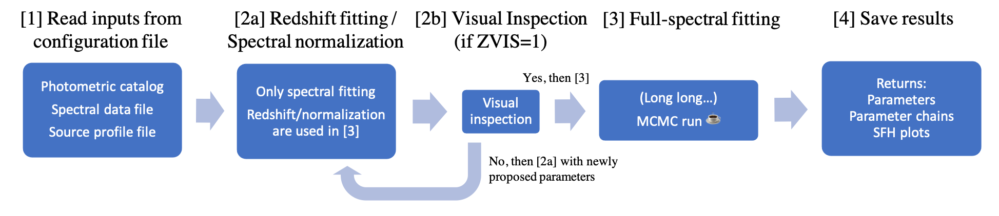

.. _overview:

Overview
========
gsf is a flexible, python-based SED fitting code designed for extra-galactic science.
gsf can fit photometric data points, simultaneously with grism spectra if provided, 
to get posterior probability of galaxy physical properties, such as stellar mass, dust attenuation,
metallicity, as well as star formation and metallicity enrichment histories.

Since it involves a Markov-Chain Monte-Carlo (MCMC) process, it usually takes more time 
(~few min to ~hour depending on the number of parameters and length of MCMC chains) than 
other SED fitting codes based on chi-square minimization.

Basic Workflow
--------------
1.gsf generates a bunch of templates at z=0 based on either fsps or B-PASS. 
This is here where you can specify basic parameters related to the templates 
(IMF, Metallicity, tau).

2.gsf shifts the templates generate above to the input redshift, both in wavelength 
and flux, to match up with observations including convolution with input filters and 
morphology if grism data. 

3.gsf runs a MCMC chain based on the minimization between data and provided templates.

4.gsf generates graphics (SED plot and history plot).

Limitations
-----------
