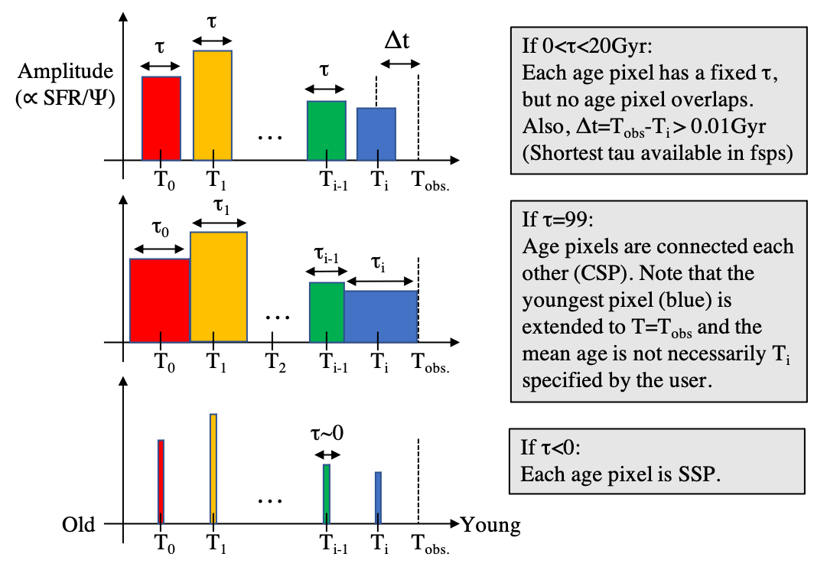

.. _templates:

Generating templates
====================

Rest-frame templates
--------------------
In this step (specifically, `make_tmp_z0`), gsf generates model spectral templates via python-fsps \citep{foreman14}, based on the parameters 
in the configuration file. The parameters are limited from the original fsps \citep{conroy09fsps}, 
such as the range in metallicity, initial mass function (IMF), and ionizing parameter. 

It is in this step that generates templates with different ages and metallicities. 
The templates are saved in a common file, "spec\_all.asdf" (irrespective to object IDs), 
for the aim of saving time. Redshifted templates (below), which are actually 
used in the fitting process, are based on this file. Therefore, if one wish to change any of 
template-critical parameters (IMF, age/metallicity range and step etc.), it is suggested to save the 
previous file to avoid overwriting, or move in another directory to avoid confusion.

Age pixels determine the number of templates at different lookback times. The length of star 
formation is specified by a parameter, TAU0, in the configuration file. The length, if specified 
to a value <99, is uniform in all age pixels in the current version. 
If set to 99, then the CSP is applied so that age pixels are continuously connected each other. 
If set to a negative value, then SSP is applied.

Shifting templates to the input redshift
----------------------------------------
In this step (specifically, `maketemp` module), gsf shifts rest-frame templates generated above 
to the input redshift and extract expected fluxes for input filters for one-to-one comparison. 
Basically there are three steps;

- Redshift templates:

.. math::

    \mathrm{wave_{obs}} = \mathrm{wave_{rest-frame}} (1 + z)

- Scaling flux:

.. math::

    \mathrm{flux_{obs}} \propto \mathrm{flux_{rest-frame}} {4 \pi d_{L}^2 \over{(1+z)}}

where :math:`d_L` is luminosity distance to the input redshift.

- IGM attenuation:

.. math::

    \mathrm{flux_{atten}} = \mathrm{flux_{int}} \exp{(-\tau)}

where gsf applies the Madau model for IGM attenuation at :math:`z>6`.

gsf will store the files generated here in a directory specified by DIR\_TEMP.
